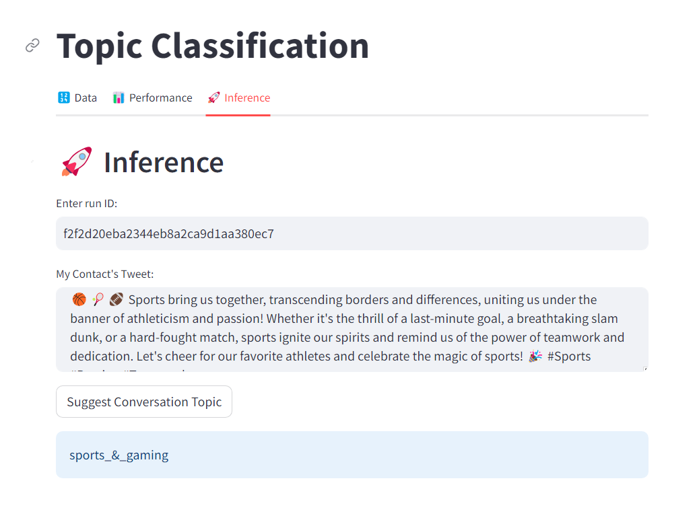

# End-To-End Topic Classification
A comprehensive MLOps pipeline designed for a topic classification project, utilizing MLflow.

# Directories

- **labs:** contains jupyter notebook labs.
- **data:** raw & processed data.
- **assets:** contains assets.
- **config:** contains:
    - **args.json** the model's training parameters.
    - **performance.json** the model's evaluation results.
    - **config.py** configurations and paths.
    - **run_id.txt** the latest mlflow run id for the latest experiment.
- **stores:** for storing the experiments' results, models and metadata.
- **UI:** a streamlit user interface.
---

# Requirements
- conda >= 23.5.0 (simply install [anaconda](https://www.anaconda.com/download))
- Python == 3.10
- mlflow==2.3.2
---

# Setup
- create virtual environment.
    ```
    conda create -p venv python=3.10
    conda activate ./venv
    python -m pip install -e .
    ```
---

# Run
- UI Demo:
    ```
    streamlit run ui/app.py
    ```

- Train:
    ```
    python topic_classification/main.py train
    # Note: for more info run `python topic_classification/main.py train --help`
    ```

- Optimize (hyperparameter tuning):
    ```
    python topic_classification/main.py optimize
    # Note: for more info run `python topic_classification/main.py optimize --help`
    ```

- Predict:
    ```
    python topic_classification/main.py predict "WRITE THE TWEET HERE"
    # Note: for more info run `python topic_classification/main.py predict --help`
    ```

# Screenshot

## Data
    


## Performance
    


## Inference
    

